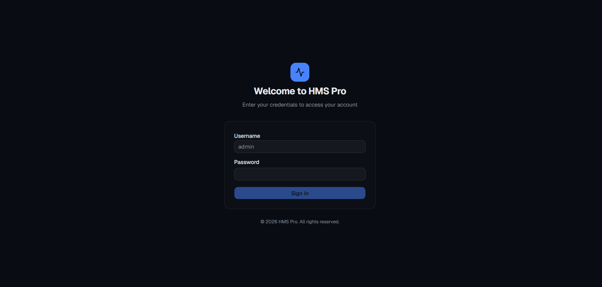
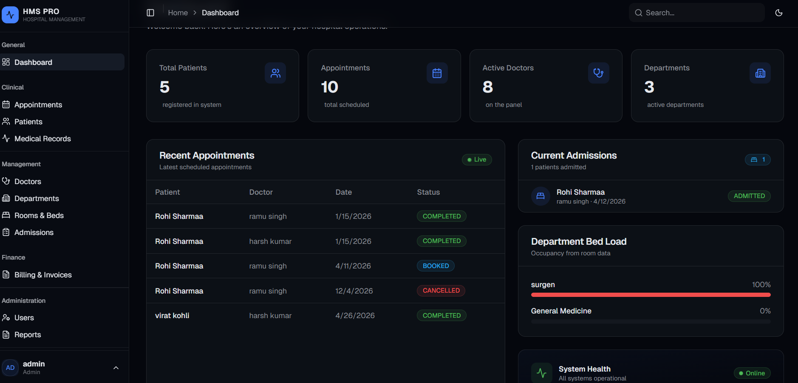
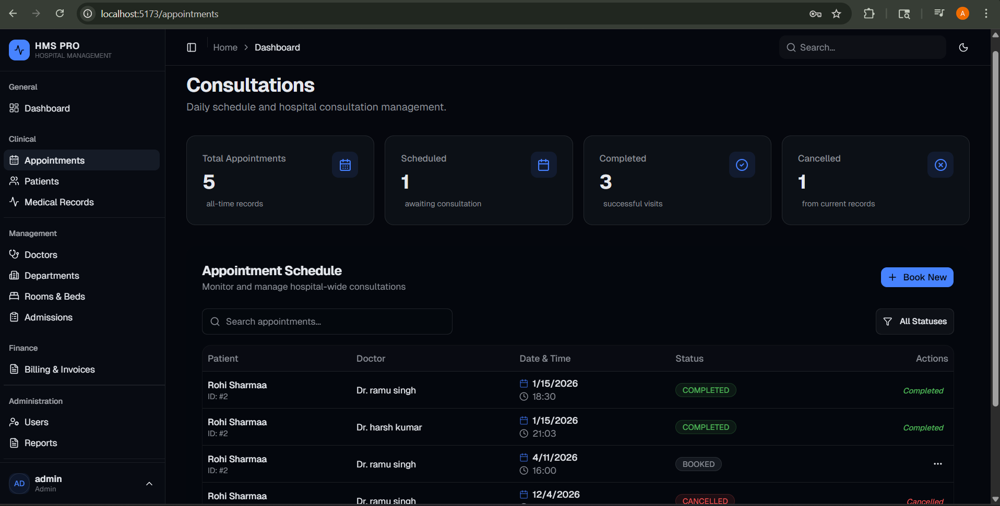
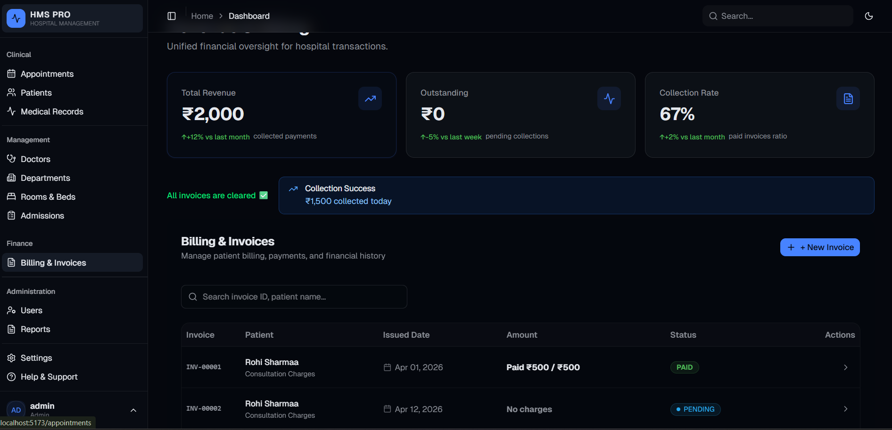
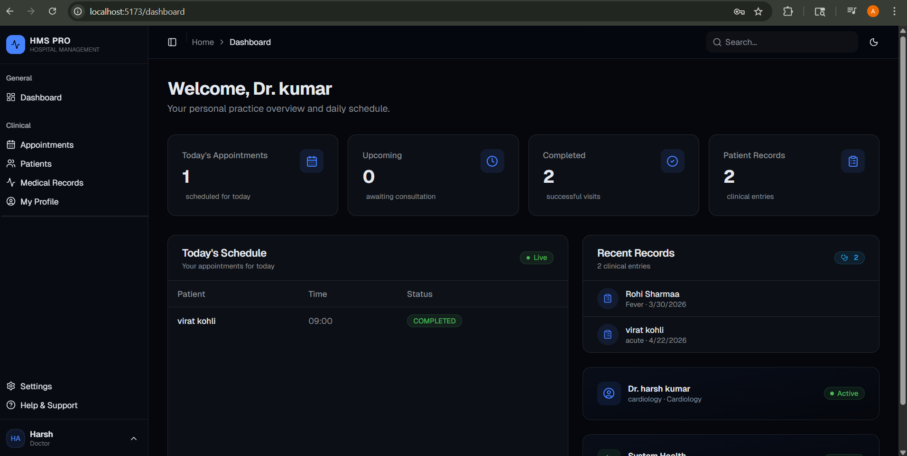
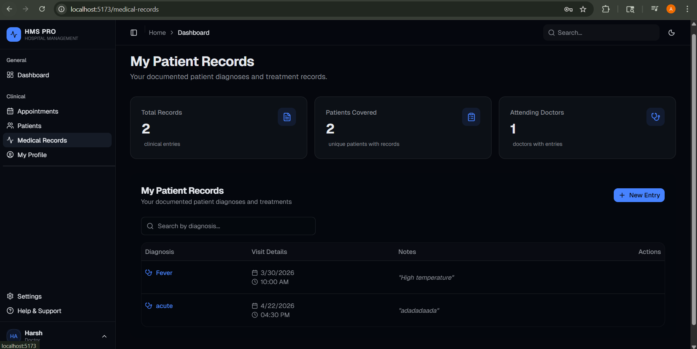
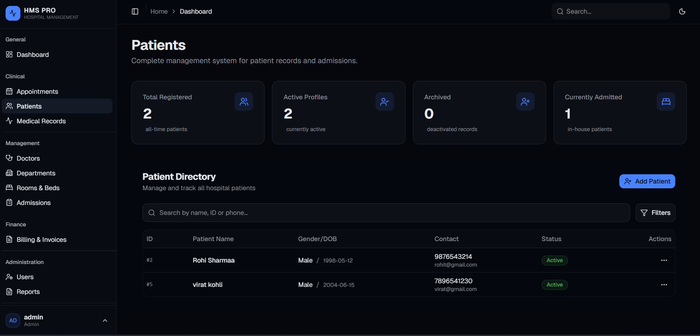

# 🏥 HMS PRO — Hospital Management System


> A full-stack Hospital Management System built with Spring Boot and React, supporting 4 role-based portals with 20+ REST APIs and 15 normalized database tables.

---

## 📌 About The Project

HMS PRO is a final year capstone project developed to digitize hospital operations. The system provides dedicated portals for Admins, Doctors, Receptionists, and Patients — each with role-specific access control and dashboards.

I led the **backend development** — responsible for database architecture, REST API design, and Spring Boot project structure.

---

## ✨ Features

- 🔐 **Role-Based Access Control** — 4 portals: Admin, Doctor, Receptionist, Patient
- 📋 **Appointment Management** — Book, update, and track appointments
- 🧾 **Billing System** — Generate and manage patient bills
- 📁 **Medical Records** — Store and retrieve patient history
- 🖥️ **14+ Responsive Screens** — Built with React.js
- 🐳 **Dockerized** — Containerized backend for easy setup

---

## 🛠️ Tech Stack

| Layer | Technology |
|-------|-----------|
| Backend | Java, Spring Boot |
| Frontend | React.js |
| Database | MySQL |
| Architecture | REST APIs, Layered (Controller → Service → Repository) |
| DevOps | Docker, Git |
| Testing | Postman |

---

## 🗄️ Database Design

- **15 normalized tables** — Users, Roles, Patients, Doctors, Appointments, Billing, Prescriptions, Medical Records, and more
- Designed with referential integrity and optimized foreign key relationships
- Role-based user management handled via dedicated tables

---

## 📡 API Overview

**20+ RESTful APIs** across the following modules:

| Module | Endpoints |
|--------|-----------|
| Auth & Roles | Login, Register, Role Assignment |
| Patient | Add, View, Update Patient |
| Doctor | Profile, Availability, Patients |
| Appointment | Book, Cancel, Reschedule |
| Billing | Generate Bill, Payment Status |
| Medical Records | Add, View, Update Records |

---

## 🚀 Local Setup

### Prerequisites
- Java 17+
- Node.js 18+
- MySQL
- Docker (optional)

### Backend Setup
```bash
# Clone the repository
git clone https://github.com/megituser/HMS.git
cd HMS

# Configure database
# Edit src/main/resources/application.properties
# Set your MySQL username, password, and DB name

# Run Spring Boot
./mvnw spring-boot:run
```

### Frontend Setup
```bash
cd frontend

# Install dependencies
npm install

# Start React app
npm start
```

### Using Docker
```bash
# Build and run with Docker
docker build -t hms-pro .
docker run -p 8080:8080 hms-pro
```

---

## 📁 Project Structure

```
HMS-B/
├── src/
│   └── main/
│       ├── java/
│       │   └── com.saad.hms/
│       │       ├── appointment/       # Appointment module
│       │       ├── billing/           # Billing & Payments
│       │       ├── config/            # App & Security Config
│       │       ├── converter/         # Data Converters
│       │       ├── department/        # Department module
│       │       ├── doctor/            # Doctor module
│       │       ├── exception/         # Global Exception Handling
│       │       ├── medicalrecord/     # Medical Records
│       │       ├── patient/           # Patient module
│       │       ├── room/              # Room management
│       │       ├── security/          # JWT & Auth Security
│       │       ├── user/              # User & Role management
│       │       ├── DashboardController.java
│       │       └── HmsApplication.java
│       └── resources/
│           └── application.properties
├── logs/
├── Dockerfile
├── pom.xml
└── README.md
```

---

## 📸 Screenshots

### 🔐 Login Page


### 📊 Admin Dashboard


### 📋 Appointments / Consultations


### 🧾 Billing & Invoices


### 👨‍⚕️ Doctor Dashboard


### 📁 Medical Records


### 🧑‍🤝‍🧑 Patient Directory


## 👨‍💻 Developer

**Arpit Pandey** — Backend Developer & Project Lead
- GitHub: [@megituser](https://github.com/megituser)
- Email: apandey9720@gmail.com

---

## 📄 License

This project is for academic and portfolio purposes.

> 💡 **Note:** To view screenshots locally, clone the repo and open the `screenshots/` folder.
